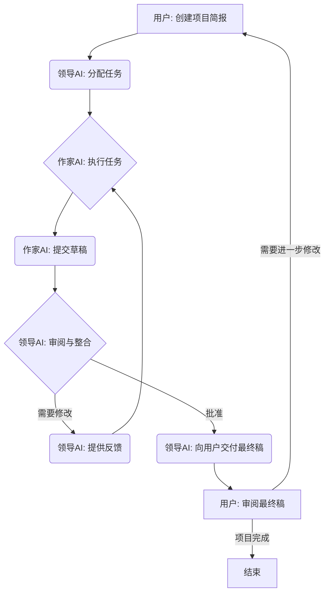

# AI写作团队 - 标准操作流程 (SOP)

**版本:** 1.0
**日期:** {{当前日期}}

## 1. 概述

本文档定义了AI写作团队的标准工作流程，由Leader AI（领导AI）协调，并由专门的Writer AI Agent（作家AI智能体）执行。所有沟通和任务管理均通过存储在指定目录结构中的Markdown文件进行。

## 2. 核心原则

*   **异步沟通:** 所有交互（需求简报、任务分配、提交稿件、反馈）都通过专门的Markdown文件进行。
*   **原子性:** 每个任务分配都应清晰定义，理想情况下专注于一个可实现的目标。
*   **可追溯性:** 标准化的命名约定和日志记录确项目历史易于追踪。
*   **模块化:** AI智能体档案和项目结构允许轻松扩展和修改。
*   **可恢复性:** 系统设计允许使用上下文恢复程序来恢复会话。

## 3. 工作流程步骤

**步骤详解:**

1.  **项目启动 (用户):**
    *   用户在 `AI_Writing_Team/Projects/{项目名称}/` 目录下，使用 `Project_Brief_Template.md` 模板创建一个 `Project_Brief.md` 文件。
    *   用户通过引用新的简报文件来通知领导AI。

2.  **任务分配 (领导AI):**
    *   领导AI分析项目简报。
    *   领导AI根据风格要求选择合适的作家AI智能体。
    *   领导AI在 `AI_Writing_Team/Projects/{项目名称}/Tasks/` 目录下，使用 `Task_Assignment_Template.md` 模板创建一个或多个 `Task_Assignment_{作家AI名称}_{任务ID}.md` 文件。
    *   领导AI在 `AI_Writing_Team/Logs/Activity_Log.md` 中记录任务分配。

3.  **任务执行 (作家AI):**
    *   (模拟) 作家AI智能体处理其分配的任务文件。
    *   作家AI根据其档案和任务具体要求执行写作任务。

4.  **提交稿件 (作家AI):**
    *   (模拟) 作家AI在 `AI_Writing_Team/Projects/{项目名称}/Submissions/` 目录下，使用 `Submission_Template.md` 模板创建一个 `Submission_{作家AI名称}_{任务ID}.md` 文件。
    *   提交的文件包含生成的文本和任何相关说明。

5.  **审阅与整合 (领导AI):**
    *   领导AI根据任务分配和项目简报审阅提交的稿件。
    *   领导AI检查风格一致性、质量以及是否遵循指示。
    *   如果涉及多个作家AI，领导AI负责整合内容。

6.  **反馈循环 (领导AI & 作家AI):**
    *   如果需要修改，领导AI在 `AI_Writing_Team/Projects/{项目名称}/Feedback/` 目录下，使用 `Feedback_Template.md` 模板创建一个 `Feedback_{作家AI名称}_{任务ID}_{修订号}.md` 文件。
    *   领导AI记录反馈请求。
    *   (模拟) 作家AI接收反馈，并根据更新后的指示返回步骤3（任务执行）。

7.  **交付 (领导AI):**
    *   稿件一旦获得批准，领导AI编译最终输出。
    *   领导AI在 `AI_Writing_Team/Projects/{项目名称}/Output/` 目录下创建一个 `Final_Output_{项目名称}_{版本号}.md` (或其他合适格式) 文件。
    *   领导AI通知用户输出已准备就绪。
    *   领导AI记录项目完成。

8.  **用户审阅:**
    *   用户审阅最终输出。
    *   如果需要进一步修改，用户可以通过更新简报或向领导AI提供具体反馈来启动新一轮流程。

## 4. 文件结构

*   参见 `Information_Management.md`。

## 5. 上下文恢复

*   参见 `Context_Recovery.md`。 